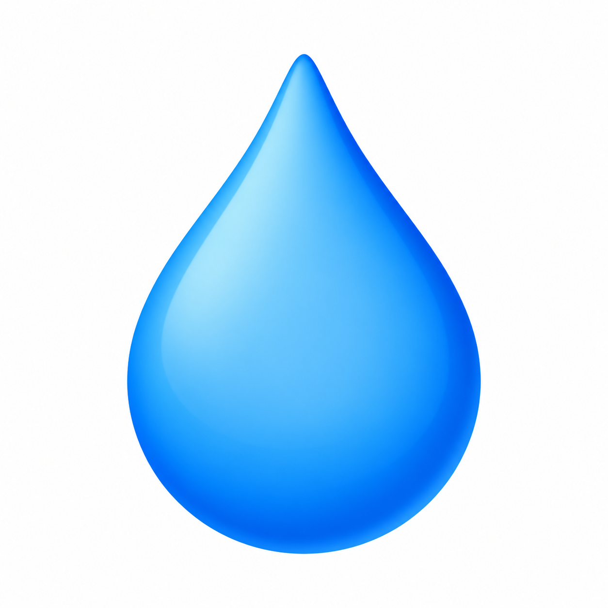
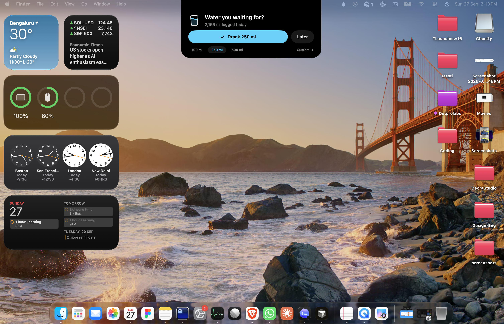

<p align="center">
  
</p>

<h1 align="center">Water, pls</h1>

<p align="center"><strong>A little nudge to drink water, right from your MacBook notch.</strong></p>

<p align="center">
  <a href="https://github.com/dhruv-colosus/water-pls/releases/latest"></a>
  
  
</p>

<p align="center">
  <a href="https://github.com/dhruv-colosus/water-pls/releases/latest">Download</a> ·
  <a href="#features">Features</a> ·
  <a href="#build-from-source">Build from source</a> ·
  <a href="https://github.com/dhruv-colosus/water-pls/issues">Report an issue</a>
</p>

Water, pls is a small, native macOS hydration tracker. It shows a gentle reminder beneath the MacBook notch, lets you log a drink in one click, and keeps your daily progress on your Mac. It needs no account, network connection, or notification permission.



## Install

Requires **macOS 14 or later**. The current download is built for **Apple silicon**.

1. Click **Download for Mac** on the website to download the bundled DMG.
2. Open the DMG and drag `WaterPls.app` onto the Applications shortcut.
3. Open the app. It is ad-hoc signed but **not Apple-notarized**, so macOS may require you to approve opening it in **System Settings → Privacy & Security**.

The app runs in the menu bar. Click the droplet to open the dashboard, preview a reminder, or quit. Closing the dashboard keeps reminders running.

## Features

- **Notch reminders:** a compact black panel expands from the MacBook notch. On a display without a notch, it appears at the top center.
- **Fast logging:** choose 100, 250, or 500 ml, enter a custom amount, or tap **Later**. A short confirmation follows each logged drink.
- **Daily dashboard:** see today's total and goal, add water, edit or reset today's total, undo the latest drink, and inspect a seven-day chart.
- **Flexible pacing:** automatically space reminders over your expected Mac-use hours or set a fixed 15–120 minute interval.
- **Activity-aware pauses:** reminders pause after two idle minutes, during sleep or lock, and when you reach your goal. Returning starts a fresh interval.
- **Local data:** drinks, daily goals, and preferences are stored in macOS UserDefaults. No account or network service is involved.

Open **Goal & reminders** from the dashboard to change your goal, usual glass size, pacing, or reminder schedule. Use **Preview reminder** there or from the menu-bar droplet to see the notch interface immediately.

## Build from source

Requires Xcode command-line tools and Swift 5.9 or later.

```sh
./scripts/build.sh
open build/WaterPls.app
```

You can also open `Package.swift` in Xcode. Run `swift test` for the hydration model tests. The build script creates an ad-hoc signed local app; it does not notarize it.

## DMG and Homebrew distribution

Run `./scripts/package-dmg.sh` to create the real macOS installer, refresh the website download, and generate `Casks/water-pls.rb` with its checksum. The build uses the supplied droplet icon.

See [the release guide](docs/RELEASING.md) for GitHub upload commands, Apple signing/notarization, and publishing a Homebrew tap. After publishing the release and tap, users can run `brew install --cask dhruv-colosus/tap/water-pls`. The tap is not published by the build script.

## Website

The Next.js website lives in [`website/`](website/README.md). To run it locally:

```sh
cd website
npm ci
npm run dev
```

The website is built and deployed separately from the Swift app.

## Notes

Water, pls is an early macOS prototype. Its reminders use a custom overlay; the app does not change the physical notch or macOS system UI. Fullscreen apps, Stage Manager, multiple Spaces, display changes, and sleep/lock transitions still need broader hands-on verification. It does not launch at login or offer exact clock-time schedules yet.

The default 2,000 ml goal and reminder intervals are editable preferences, not health recommendations. Activity is estimated from keyboard and mouse idle time while the app runs; it does not read macOS Screen Time.
